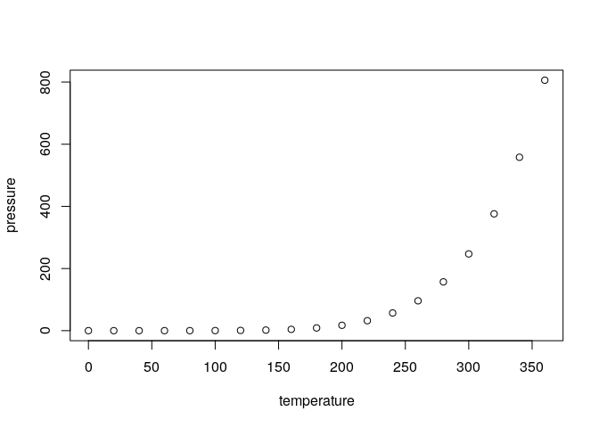

R Mini Tutorial: Basics objects
================
luiscartor
May 29, 2019

1. Getting started
------------------

In Unix or Mac, execute R on the command line, or click on the R icon on the desktop for Windows.

To finish an R session, type `q()` at the command prompt. You will be asked to save the workspace when finishing the session. It is a good practice to NOT to save the session, but if you say yes, the objects on your workspace will be saved as a .RData file. If saved, these workspace will be loaded when you open a new session.

1.1 Basic calculations
----------------------

Use the console to execute R commands, such as basic calculations. After hiting enter, the console will show the result.

``` r
  3+2
```

    ## [1] 5

But the result of the calculation can be also stored to a variable:

``` r
  a <- 3+2
```

Variable names in R must begin with a letter, followed by aphanumeric characters. Periods or underscores are often used to break up long variables (e.g. `long_variable`). Use variable names that help you identify the variable, but without being very long (e.g. herons\_popmean). Avoid `c`, `q`, `t`, `C`, `D`, `F`, `I`, `T`, and things like `mean`, `var`, `sd`, as they are built-in R functions and they will cause errors.

Now '5' is stored in the variable a. To print the value of a variable, just type the variable name:

``` r
  a
```

    ## [1] 5

Some arithmetic operators:

| Operator  | Description    |
|-----------|----------------|
| +         | addition       |
| -         | subtraction    |
| \*        | multiplication |
| /         | division       |
| ^ or \*\* | exponentiation |

Some comparison and logical operators:

| Operator | Description              |
|----------|--------------------------|
| &gt;     | greater than             |
| &gt;=    | greater than or equal to |
| ==       | exactly equal to         |
| !=       | not equal to             |
| !        | logical NOT              |
| &        | logical AND              |

Now we can start creating variables and making arithmetic and logical operations.

``` r
x <- 5
y <- 2
z1 <- x*y
z2 <- x/y
z3 <- x^y
z1; z2; z3
```

    ## [1] 10

    ## [1] 2.5

    ## [1] 25

Note that we can use a semicolon to put two or more commands in one line. In the last line of code, we use the semicolon to print the values of the three z variables.

Apart from |sqrt() | squared root |

We can combine several operations:

``` r
A <- 5; B <- 3
C <- (A+B)/(A+5*B) 
C
```

    ## [1] 0.4

And use the logical operators:

``` r
A == B
```

    ## [1] FALSE

``` r
A > B
```

    ## [1] TRUE

``` r
C != B
```

    ## [1] TRUE

We can use a wide rage of built-in mathematical functions in R

| R command              | function                          |
|------------------------|-----------------------------------|
| abs()                  | absolute value, $                 |
| cos(), sin(), tan()    | cosine, sine, tangent             |
| acos(), asin(), atan() | arc-cosine, arc-sine, arc-tangent |
| exp(x)                 | exponential function              |
| log(x)                 | natural (base-e) logarithm        |
| log10(x)               | base-10 logarithm                 |
| sqrt(x)                | square root, √x                   |

For example, try this calculations:

``` r
A <- 5; B <- 3
C <- (A+2*sqrt(B))/(A+5*sqrt(B)) 
D <- log(A+B)/cos(C)
C;D
```

    ## [1] 0.6196152

    ## [1] 2.554277

As usual, parentheses alter the order of the operations. Try:

``` r
C <- A+2*sqrt(B)/A+5*sqrt(B)
C
```

    ## [1] 14.35307

and

``` r
C <- A + 2*(sqrt(B)/A + 5) *sqrt(B)
C
```

    ## [1] 23.52051

<br>

> ### Excersise: Solve the following equations
>
> 1.  1 + 0.3 + 0.7<sup>2</sup>
> 2.  For a = 0.5 and b = 1: sin(*a*)cos(*b*)+cos(*a*)
> 3.  *e**x**p*(0.5<sup>2</sup>/(4))
> 4.  For a = 10 and b = 2: *l**o**g*(*a*)−3 \* *l**o**g*10(*b*)

<br>

1.2 Basics Data Types
---------------------

1.2.1 Vectors and matrices
--------------------------

``` r
  vec <- seq(1:5)
  vec[1:3]
```

    ## [1] 1 2 3

``` r
summary(cars)
```

    ##      speed           dist       
    ##  Min.   : 4.0   Min.   :  2.00  
    ##  1st Qu.:12.0   1st Qu.: 26.00  
    ##  Median :15.0   Median : 36.00  
    ##  Mean   :15.4   Mean   : 42.98  
    ##  3rd Qu.:19.0   3rd Qu.: 56.00  
    ##  Max.   :25.0   Max.   :120.00

Including Plots
---------------

You can also embed plots, for example:



Note that the `echo = FALSE` parameter was added to the code chunk to prevent printing of the R code that generated the plot.
