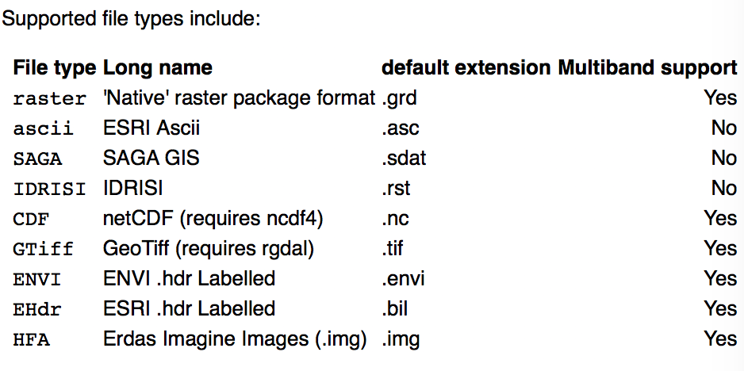
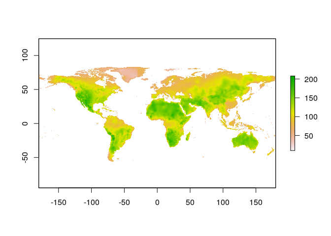
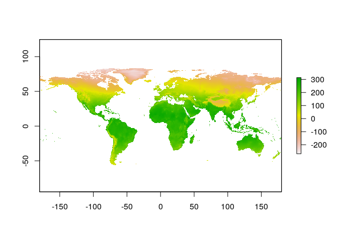
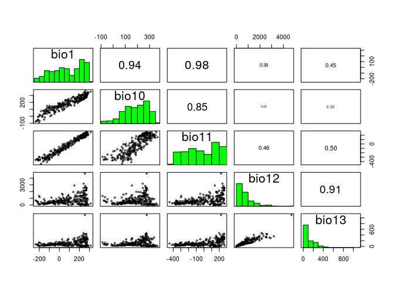

R Mini Tutorial: R for spatial modelling
================
luiscartor
May 29, 2019

3.1 Raster data
---------------

Rasters are representations of the world that use a grid of equally sized rectangles, normally called cells. In remote sensing or photogrammetry, these cells are known as pixels. Every raster cell has a value associated, representing an average of the value for the area that it covers. Because a raster structure is regular, we do not need a coordinate for every cell, but we need a coordinate reference system (CRS) to situate the regular grid in space. From the CRS and an origin point, we can calculate single cell coordinates by calculating the distance to the origin.

A raster consists on three components: 1) a grid with some dimensions (number of rows and columns), resolution (cell size) and extent (edges of the grid); 2) cell values (typically in the form of a matrix); 3) Projection information (CRS).

Let's load the `raster` library and create a folder to store our spatial data:

``` r
library("raster")  # Loads raster package
```

    ## Loading required package: sp

``` r
if(!file.exists("spatialdata")) dir.create("spatialdata")     # Creates folder to store spatial data
```

### 3.1.2 Creating a raster file

We can create a raster from scratch by defining the three components studied before:

``` r
first_raster <- raster(ncol = 10, nrow = 5, xmn = 0, xmx = 10, ymn = 0, ymx = 5)
first_raster 
```

    ## class      : RasterLayer 
    ## dimensions : 5, 10, 50  (nrow, ncol, ncell)
    ## resolution : 1, 1  (x, y)
    ## extent     : 0, 10, 0, 5  (xmin, xmax, ymin, ymax)
    ## crs        : +proj=longlat +datum=WGS84 +ellps=WGS84 +towgs84=0,0,0

We specified the number of columns and rows, the edges (x and y min and max). We have authomatically assigned the resolution (by assigning origins and number of columns and rows). We then have all the parts of the 1st raster component.

Let's now assign some values to the raster:

``` r
values(first_raster) <- runif(ncell(first_raster))     # We assign values random values to the 50 cells
plot(first_raster)                  # plot() works for plotting simple raster maps
```


We have assigned random a value to each cell, starting from the top left cell and moving row to rwo from left to right.

Finally we need to add the third component of a raster, its projection. We use what it is called a proj4 string, which assignes a particular projection using standardized projections codes.

``` r
projection(first_raster) <- "+proj=longlat +datum=WGS84 +ellps=WGS84"

first_raster
```

    ## class      : RasterLayer 
    ## dimensions : 5, 10, 50  (nrow, ncol, ncell)
    ## resolution : 1, 1  (x, y)
    ## extent     : 0, 10, 0, 5  (xmin, xmax, ymin, ymax)
    ## crs        : +proj=longlat +datum=WGS84 +ellps=WGS84 +towgs84=0,0,0 
    ## source     : memory
    ## names      : layer 
    ## values     : 0.01577538, 0.979196  (min, max)

### 3.1.3 Download, read, and write raster files

We will download and take a look at bioclimatic variables from worldclim.org. We use `download.file()` to directly download worldclim data, and used `unzip()` to unzip the zipped file:

``` r
# download climate data from worldclim.org
if(!file.exists("spatialdata/bioclim")) dir.create("spatialdata/bioclim")
if( !file.exists( paste0("spatialdata/bioclim/bio_10m_bil.zip")   )){
  utils::download.file(url="http://biogeo.ucdavis.edu/data/climate/worldclim/1_4/grid/cur/bio_10m_bil.zip",
                       destfile="spatialdata/bioclim/bio_10m_bil.zip"   ) 
  utils::unzip("spatialdata/bioclim/bio_10m_bil.zip",exdir="spatialdata/bioclim") 
}
```

Now our downloaded data is in our spatialdata folder. We can start reading the data, and write it again to convert it in different file types:

``` r
bioclim1 <- raster("spatialdata/bioclim/bio1.bil")          # Reads raster
if(!file.exists("temp")) dir.create("temp")                                 # Creates a temporal directory
writeRaster(bioclim1,"temp/bio1.bil",overwrite=TRUE)   # We can write the read raster to several formats
writeRaster(bioclim1,"temp/bio1.tiff",overwrite=TRUE)
```

Or we can also read all 19 layers at one time:

``` r
# search files with .bil file extension
clim_list <- list.files("spatialdata/bioclim/",pattern=".bil$",full.names = T)
clim_list
```

    ##  [1] "spatialdata/bioclim//bio1.bil"  "spatialdata/bioclim//bio10.bil"
    ##  [3] "spatialdata/bioclim//bio11.bil" "spatialdata/bioclim//bio12.bil"
    ##  [5] "spatialdata/bioclim//bio13.bil" "spatialdata/bioclim//bio14.bil"
    ##  [7] "spatialdata/bioclim//bio15.bil" "spatialdata/bioclim//bio16.bil"
    ##  [9] "spatialdata/bioclim//bio17.bil" "spatialdata/bioclim//bio18.bil"
    ## [11] "spatialdata/bioclim//bio19.bil" "spatialdata/bioclim//bio2.bil" 
    ## [13] "spatialdata/bioclim//bio3.bil"  "spatialdata/bioclim//bio4.bil" 
    ## [15] "spatialdata/bioclim//bio5.bil"  "spatialdata/bioclim//bio6.bil" 
    ## [17] "spatialdata/bioclim//bio7.bil"  "spatialdata/bioclim//bio8.bil" 
    ## [19] "spatialdata/bioclim//bio9.bil"

The `stack` function allows us to have all layers together in the same raster object:

``` r
# stacking the bioclim variables to process them at one go 
clim <- raster::stack(clim_list) 
```



### 3.1.4 Explore raster data

Let's take a look at the raster information:

``` r
bioclim1 <- raster("spatialdata/bioclim/bio1.bil")
bioclim1
```

    ## class      : RasterLayer 
    ## dimensions : 900, 2160, 1944000  (nrow, ncol, ncell)
    ## resolution : 0.1666667, 0.1666667  (x, y)
    ## extent     : -180, 180, -60, 90  (xmin, xmax, ymin, ymax)
    ## crs        : +proj=longlat +datum=WGS84 +no_defs +ellps=WGS84 +towgs84=0,0,0 
    ## source     : /home/lcarrasco/Documents/teaching/R_MiniTutorial/spatialdata/bioclim/bio1.bil 
    ## names      : bio1 
    ## values     : -269, 314  (min, max)

We can use other commands to access a particular raster information:

``` r
nrow(bioclim1)       # Reads the number of rows
```

    ## [1] 900

``` r
ncol(bioclim1)       # Reads the number of columns
```

    ## [1] 2160

``` r
extent(bioclim1)     # Reads the extent
```

    ## class      : Extent 
    ## xmin       : -180 
    ## xmax       : 180 
    ## ymin       : -60 
    ## ymax       : 90

What is the coordinate reference system?

``` r
crs(bioclim1)
```

    ## CRS arguments:
    ##  +proj=longlat +datum=WGS84 +no_defs +ellps=WGS84 +towgs84=0,0,0

And the resolution?

``` r
res(bioclim1)
```

    ## [1] 0.1666667 0.1666667

The resolution shows the pixel dimensions in lat/long. This is equivalent to about 18x18 sqared km.

We will now see the information of the raster stack that we created before:

``` r
clim
```

    ## class      : RasterStack 
    ## dimensions : 900, 2160, 1944000, 19  (nrow, ncol, ncell, nlayers)
    ## resolution : 0.1666667, 0.1666667  (x, y)
    ## extent     : -180, 180, -60, 90  (xmin, xmax, ymin, ymax)
    ## crs        : +proj=longlat +datum=WGS84 +no_defs +ellps=WGS84 +towgs84=0,0,0 
    ## names      :  bio1, bio10, bio11, bio12, bio13, bio14, bio15, bio16, bio17, bio18, bio19,  bio2,  bio3,  bio4,  bio5, ... 
    ## min values :  -269,   -97,  -488,     0,     0,     0,     0,     0,     0,     0,     0,     9,     8,    72,   -59, ... 
    ## max values :   314,   380,   289,  9916,  2088,   652,   261,  5043,  2159,  4001,  3985,   211,    95, 22673,   489, ...

We can see now that the raster stack contains 19 layers. One for each bioclimate variable. All layers have the same CRS, extent and resolution.

We have access to each of these layers by using bracket subsetting:

``` r
clim[[12]]
```

    ## class      : RasterLayer 
    ## dimensions : 900, 2160, 1944000  (nrow, ncol, ncell)
    ## resolution : 0.1666667, 0.1666667  (x, y)
    ## extent     : -180, 180, -60, 90  (xmin, xmax, ymin, ymax)
    ## crs        : +proj=longlat +datum=WGS84 +no_defs +ellps=WGS84 +towgs84=0,0,0 
    ## source     : /home/lcarrasco/Documents/teaching/R_MiniTutorial/spatialdata/bioclim/bio2.bil 
    ## names      : bio2 
    ## values     : 9, 211  (min, max)

``` r
plot(clim[[12]])
```



Bioclim variable 12 represents the annual precipitation.

### 3.1.5 Raster manipulation

First, we will try to resample a raster layer. We want the new layer to be 10 times coarser at each axis (i.e., 100 times coarser). In essence, we are resampling the resolution from 10 min to 100 min.

``` r
bioclim1 <- raster("spatialdata/bioclim/bio1.bil")
# define new resolution
newRaster <- raster( nrow= nrow(bioclim1)/10 , ncol= ncol(bioclim1)/10 )
# define the extent of the new coarser resolution raster
extent(newRaster) <- extent(bioclim1)
# fill the new layer with new values
newRaster <- resample(x=bioclim1,y=newRaster,method='bilinear')
# when viewing the new layer, we see that it appears coarser
plot(bioclim1)
```



``` r
plot(newRaster) 
```


<br>

Let's do some operations with rasters. We will use the precipitation layers from bioclim:

``` r
wet <- raster("spatialdata/bioclim/bio13.bil") # precipitation of wettest month
dry <- raster("spatialdata/bioclim/bio14.bil") # precipitation of driest month

# To calculate difference between these two rasters
diff <- wet - dry
names(diff) <- "diff"
diff
```

    ## class      : RasterLayer 
    ## dimensions : 900, 2160, 1944000  (nrow, ncol, ncell)
    ## resolution : 0.1666667, 0.1666667  (x, y)
    ## extent     : -180, 180, -60, 90  (xmin, xmax, ymin, ymax)
    ## crs        : +proj=longlat +datum=WGS84 +no_defs +ellps=WGS84 +towgs84=0,0,0 
    ## source     : memory
    ## names      : diff 
    ## values     : 0, 2088  (min, max)

We can see that the new layer is also a raster. We can also make operations between the layers of a stack file:

``` r
# To calculate the mean between the dry and wet rasters
twoLayers <- stack(wet,dry)
meanPPT1 <- calc(twoLayers,fun=mean)
names(meanPPT1) <- "mean"

# The following code gives the same results
meanPPT2 <-  (wet + dry)/2
names(meanPPT2) <- "mean"
layers_to_plot <- stack(wet, dry, diff, meanPPT1,meanPPT2)
plot(layers_to_plot)
```


<br>

Now we will calculate the correlation between raster layers:

``` r
# search files with *.bil* file extension
clim_list <- list.files("spatialdata/bioclim/",pattern=".bil$",full.names = T)
# stacking the bioclim variables to process them at one go 
clim <- raster::stack(clim_list) 
# select the first 5 layers
clim_subset <- clim[[1:5]]
# to run correlations between different layers
raster::pairs(clim_subset,maxpixels=1000) # the default is maxpixels=100000
```



The `pairs()` function from the `raster` package pairs plots of layers and calculates correlations between layers' data.

3.2 Vector data
---------------

### 3.2.1

3.3 Spatial analysis
--------------------
